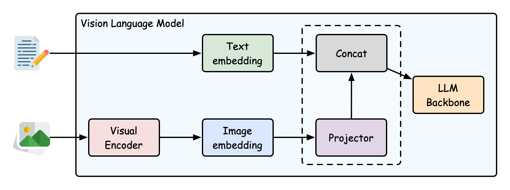

# small-vlm



A flexible and configurable Vision Language Model (VLM) framework built with PyTorch, designed for experimentation and ease of use. This framework allows for modular replacement of core components and fine-grained control over training parameters.

## Features

- **Modular Design**: Easily swap out the Language Model (LLM), Visual Encoder, and Connector components to experiment with different architectures.
- **Configuration Management**: Utilizes [Hydra](https://hydra.cc/) for robust and flexible configuration management, allowing you to define and override parameters easily.
- **Environment Setup**: Uses [uv](https://github.com/astral-sh/uv) for fast and reliable Python environment and package management.
- **Granular Training Control**:
  - Independently set learning rates and weight decay for the LLM, visual encoder, and connector.
  - Independently freeze or unfreeze these components during different training stages.
- **LLaVA Implementation**: Includes a straightforward reproduction of the LLaVA model (pretraining and finetuning).
- **Hugging Face Hub Integration**:
  - Easily push your trained models to the Hugging Face Hub using a simple script.
  - Load models pushed to the Hub using the standard `AutoModel` and `AutoProcessor` classes from the `transformers` library.

## Architecture

The VLM consists of three main components:

- **Visual Encoder**: Extracts visual features from images. Supports various vision transformers (e.g., CLIP). Configurable via `model.visual_encoder` in Hydra configs.
- **Language Model**: Processes text and generates responses. Supports various Hugging Face language models. Configurable via `model.language_model` in Hydra configs.
- **Connector**: Bridges the visual and language modalities. Supports different projection mechanisms (e.g., MLP). Configurable via `model.connector` in Hydra configs.

## Setup and Installation

1.  **Environment Setup with uv**:
    This project uses `uv` for Python environment and dependency management. For instructions on installing `uv` and setting up Python, please refer to [installation.md](installation.md).

2.  **Install Dependencies**:
    Once `uv` is installed and you have cloned the repository, install the necessary dependencies:

    ```bash
    make install
    ```

## Training

Training is managed via Hydra configurations and executed using DeepSpeed.

### LLaVA Pretraining

To pretrain the LLaVA model, run:

```bash
deepspeed --module vlm -cn pretrain-llava
```

### Customization

You can customize various aspects of the model and training process through Hydra configurations located in `src/vlm/config/`. This includes:

- **Model Components**:
  - `model.visual_encoder.hf_name`: Hugging Face name of the visual encoder.
  - `model.language_model.hf_name`: Hugging Face name of the language model.
  - `model.connector.name` and `model.connector.type`: Define the type and specifics of the connector module.
- **Training Parameters per Component**:
  - `trainer.unfreeze`: Booleans `train_vision_model`, `train_language_model`, `train_connector` to control which parts are trainable.
  - `trainer.learning_rate`: Specific learning rates like `visual_encoder_learning_rate`, `language_model_learning_rate`, `connector_learning_rate`.
  - `trainer.weight_decay`: Specific weight decays like `visual_encoder_weight_decay`, `language_model_weight_decay`, `connector_weight_decay`.

For example, to change the learning rate for the language model during finetuning, you could modify `src/vlm/config/trainer/learning_rate/llava-finetune.yaml` or override it via the command line:

```bash
deepspeed --module vlm -cn finetune-llava trainer.learning_rate.language_model_learning_rate=5e-6
```

## Inference

You can refer to `src/vlm/inference/eval.py`

## LLaVA Reproduction Results (Using [lmms-eval](https://github.com/EvolvingLMMs-Lab/lmms-eval))

| Task           | Metric               | [Reproduced LLaVA](https://huggingface.co/Leonardo6/llava-7b-v1.5) (Value ± Stderr) | [Original LLaVA](liuhaotian/llava-v1.5-7b) (Value ± Stderr) |
| -------------- | -------------------- | ----------------------------------------------------------------------------------- | ----------------------------------------------------------- |
| gqa            | exact_match          | 0.6201 ± 0.0043                                                                     | 0.6192 ± 0.0043                                             |
| mmbench_cn_cc  | gpt_eval_score       | 25.2941 ± N/A                                                                       | 23.5294 ± N/A                                               |
| mmbench_cn_dev | gpt_eval_score       | 54.8969 ± N/A                                                                       | 55.6701 ± N/A                                               |
| mmbench_en_dev | gpt_eval_score       | 66.0653 ± N/A                                                                       | 64.0893 ± N/A                                               |
| mmbench_ru_dev | gpt_eval_score       | 54.9282 ± N/A                                                                       | 53.0144 ± N/A                                               |
| mme            | mme_cognition_score  | 321.4286 ± N/A                                                                      | 355.7143 ± N/A                                              |
| mme            | mme_perception_score | 1505.4650 ± N/A                                                                     | 1509.1289 ± N/A                                             |
| scienceqa      | exact_match          | 0.6977 ± 0.0071                                                                     | 0.6572 ± 0.0073                                             |
| seedbench      | seed_all             | 0.5299 ± N/A                                                                        | 0.5359 ± N/A                                                |
| seedbench      | seed_image           | 0.6593 ± N/A                                                                        | 0.6616 ± N/A                                                |
| textvqa_val    | exact_match          | 0.4902 ± 0.0068                                                                     | 0.4600 ± 0.0068                                             |

## Pushing Models to Hugging Face Hub

This project provides a script to easily upload your trained models and processors to the Hugging Face Hub.

1.  **Run the push script**:
    Execute the `push-to-hub` command (which calls the `push_vlm_to_hub` function):

    ```bash
    push-to-hub
    ```

    The script will interactively ask for:

    - Path to your pretrained/finetuned model checkpoint directory.
    - The desired repository name on the Hub (e.g., `your-username/your-model-name`).
    - Whether to force push if the repository already exists.

2.  **Loading from Hub**:
    Once pushed, your model can be loaded by anyone using the standard `transformers` library:

    ```python
    from transformers import AutoModel, AutoProcessor

    repo_id = "your-username/your-model-name"
    model = AutoModel.from_pretrained(repo_id, trust_remote_code=True)
    processor = AutoProcessor.from_pretrained(repo_id, trust_remote_code=True)

    # ... proceed with inference
    ```

    The `push-to-hub` script automatically prepares the necessary configuration files (`modeling_vlm.py`, `processing_vlm.py`, `configuration_vlm.py`, `connectors.py`) and updates `config.json` and `processor_config.json` to enable this seamless loading.

---

_This project was built from
[simple-modern-uv](https://github.com/jlevy/simple-modern-uv) and [LLaVa](https://github.com/haotian-liu/LLaVA)._
